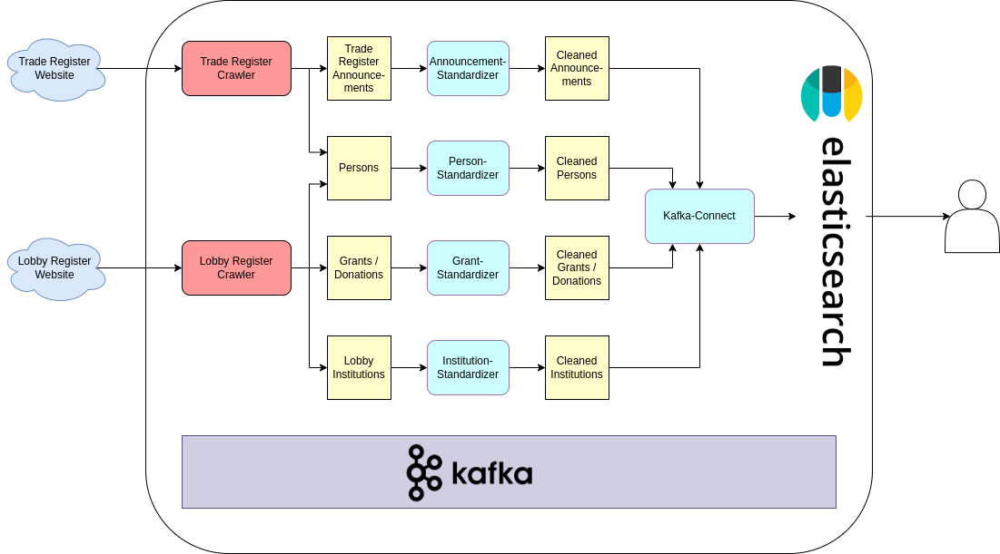

# HPI information integration project SoSe 2022

This project is the exercise for the HPI lecture "Information Integration" at HPI of [@grittaweisheit](https://github.com/grittaweisheit) and [@lucprestin](https://github.com/LucPrestin). For the documentation, please have a look at our [wiki](https://github.com/LucPrestin/hpi-ii-project-2022/wiki)



# Setup

## Prerequisites

- Install [sed](https://wiki.ubuntuusers.de/sed/)
- Install [poetry](https://python-poetry.org/docs/#installation)
- Install [docker](https://docs.docker.com/get-docker/) and [docker-compose](https://docs.docker.com/compose/install/)
- Install a protobuf compiler. We used [protoc](https://grpc.io/docs/protoc-installation/) as a default. If you want to use a different one, you need to adapt `generate-proto.sh` accordingly.
- Install [jq](https://stedolan.github.io/jq/download/)

## Installation

```shell
# clone the project
git clone git@github.com:LucPrestin/hpi-ii-project-2022.git

cd hpi-ii-project-2022

# install the python dependencies
poetry install

# generate python classes from .proto files
./generate-proto.sh
```

# Running

```shell
# start the infrastructure
docker-compose up

# start the kafka-connector to elasticsearch
./connect/push-config.sh

# start crawling the lobby register
poetry run python ./information_integration/main.py lobby_register crawl_all

# or start crawling the trade register
poetry run python ./information_integration/main.py trade_register crawl --id <start id> --state <state abbreviation>
```

# Querying Data

## Kowl

Kowl is a dashboard for kafka applications. Its default location is [http://localhost:8080](http://localhost:8080). For further information, have a look at the [wiki](https://github.com/LucPrestin/hpi-ii-project-2022/wiki/Kowl).

## Elasticsearch

To query the data from Elasticsearch, you can use
the [query DSL](https://www.elastic.co/guide/en/elasticsearch/reference/7.17/query-dsl.html) of elastic. For example:

```shell
curl -X GET "localhost:9200/_search?pretty" -H 'Content-Type: application/json' -d'
{
    "query": {
        "match": {
            "name": "Mustermann, Max"
        }
    }
}
'
```
# Teardown

```shell
docker-compose down
```
